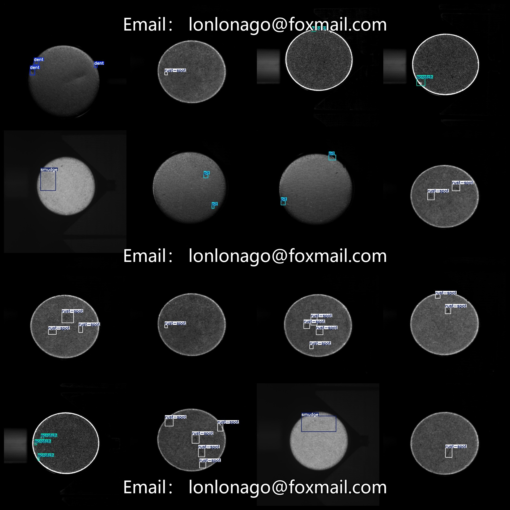
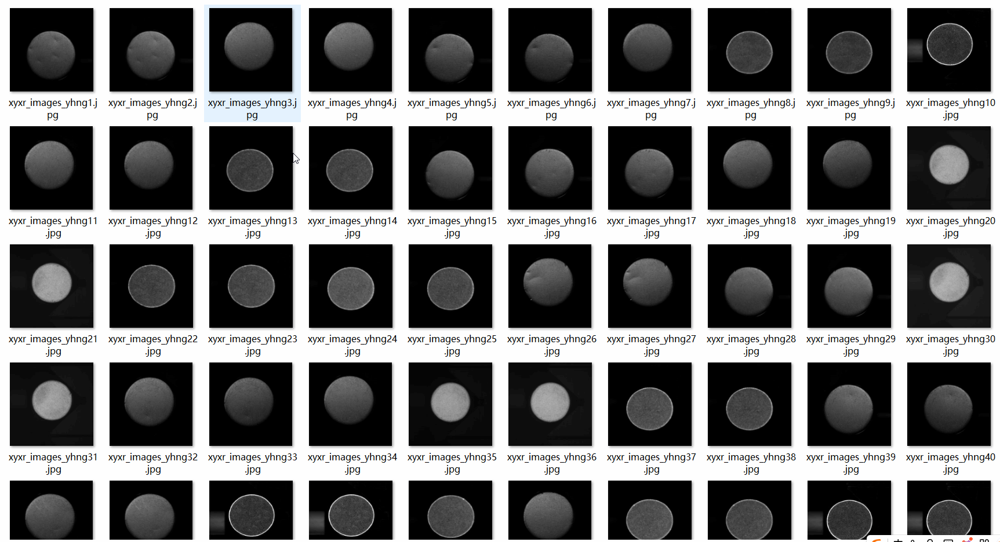

# [Object Detection] Industrial Defect Detection Dataset 4651 images in YOLO+VOC format

[Object Detection] The industrial defect detection dataset contains 4651 images in both YOLO and VOC format.

The dataset is organized into three folders: JPEGImages, Annotations, and labels. Each folder stores the corresponding type of files:
- JPEGImages folder contains a total of 4651 jpg images.
- Annotations folder contains a total of 4651 xml files.
- labels folder contains a total of 4651 txt files.

There are a total of 5 label types: "dent", "pit", "rust-spot", "scratch", and "smudge".

The Chinese translation for these labels can be found in the ["dent","pit","rust-spot","scratch","smudge"] list.

Each label has a specific number of bounding boxes (yolo format) as follows:
- Dent: 1803 bounding boxes
- Pit: 1930 bounding boxes
- Rust-spot: 2223 bounding boxes
- Scratch: 1478 bounding boxes
- Smudge: 810 bounding boxes

The total number of bounding boxes is 8244.

All images have high resolution clarity (pixel size).

The images are not enhanced.

The shape of the labels is square, which is used for target detection recognition.

Special Note: There is no guarantee for the accuracy or weight files trained on this dataset. Only accurate and reasonable annotations are provided.

Label and Image Overview:

## Images

---

Here is a pay link on Stripe (https://buy.stripe.com/3cs8yP7sY87d0vu9AB). Please contact me lonlonago@foxmail.com after funding $89, and I will send you a complete data files, thank you!

